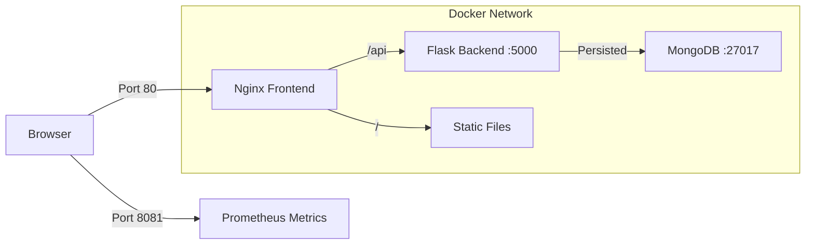

# SmartCart

<div align="center">


**A family grocery list management application with multi-tenancy support and AI-powered price estimation.**

[Quick Start](#quick-start) • [Configuration](#configuration) • [Development](#development) • [API Documentation](#api-documentation) • [Troubleshooting](#troubleshooting)

</div>

## Overview

SmartCart is a collaborative web application designed to streamline grocery shopping for families and groups. It allows members to add items to a shared list, while managers maintain control through approval workflows. The system leverages AI to estimate prices automatically, helping users budget effectively.

## Features

-   **Multi-Tenancy**: Complete data isolation between groups.
-   **Role-Based Access**: Granular permissions for **Managers** (approve/reject/manage users) and **Members** (add items).
-   **AI Integration**: Automatic price estimation for added items using OpenAI.
-   **Real-Time Sync**: Polling mechanism ensures all users see the latest list state.
-   **Observability**: Integrated Prometheus metrics for monitoring application health and usage.

## Architecture

SmartCart employs a containerized microservices architecture:



### Services

| Service | Internal Port | Host Port | Description |
| :--- | :--- | :--- | :--- |
| **Frontend** | 80 | **80** | Nginx serving static assets and reverse proxying API requests. |
| **Backend** | 5000 | - | Flask REST API (accessible only via Nginx). |
| **Backend (Metrics)** | 8081 | **8081** | Dedicated Prometheus metrics endpoint. |
| **Database** | 27017 | - | MongoDB for data persistence. |

## Quick Start

### Prerequisites

-   [Docker](https://docs.docker.com/get-docker/) and [Docker Compose](https://docs.docker.com/compose/install/)
-   An OpenAI API Key (for price estimation features)

### One-Command Setup

1.  **Clone the Repository**
    ```bash
    git clone https://github.com/yourusername/SmartCart.git
    cd SmartCart
    ```

2.  **Configure Environment**
    Create a `.env` file from the example:
    ```bash
    cp .env.example .env
    # Edit .env to add your OPENAI_API_KEY
    ```

3.  **Run with Docker Compose**
    ```bash
    docker-compose up --build -d
    ```

4.  **Access the Application**
    -   Web UI: [http://localhost](http://localhost)
    -   Metrics: [http://localhost:8081/metrics](http://localhost:8081/metrics)
    -   Health Check: [http://localhost/api/health](http://localhost/api/health)

### Stopping the App

To stop containers and preserve data:
```bash
docker-compose down
```

To stop containers and **destroy** data (reset):
```bash
docker-compose down -v
```

## Configuration

### Environment Variables

The application is configured via environment variables. These can be set in the `.env` file or passed to the Docker container.

| Variable | Description | Default / Required |
| :--- | :--- | :--- |
| **Backend Configuration** |
| `OPENAI_API_KEY` | Key for OpenAI API (Price Estimation) | **Required** |
| `OPENAI_MODEL` | OpenAI model to use | `gpt-4o-mini` |
| `JWT_SECRET` | Secret key for signing JWT tokens | **Required** (set in .env) |
| `MONGO_URI` | MongoDB connection string | `mongodb://...` (AUTO configured in Docker) |
| `METRICS_PORT` | Port for Prometheus metrics server | `8081` |
| **Database Initialization** |
| `MONGO_INITDB_ROOT_USERNAME` | Admin username for MongoDB | `admin` |
| `MONGO_INITDB_ROOT_PASSWORD` | Admin password for MongoDB | `password` |

### Database Setup

-   **Initialization**: The MongoDB container initializes automatically using the credentials provided in `.env`.
-   **Persistence**: Data is stored in a Docker volume named `mongodb_data`.
-   **Backup**: You can use the following command to create a backup:
    ```bash
    docker run --rm -v smartcart_mongodb_data:/data -v $(pwd):/backup alpine tar czf /backup/db_backup.tar.gz /data
    ```

## Development

### Project Structure

```
SmartCart/
├── backend/                # Flask Application
│   ├── src/                # Source code
│   ├── tests/              # Pytest suites
│   └── Dockerfile          # Backend container definition
├── frontend/               # Static Web Assets
│   ├── nginx.conf          # Nginx configuration
│   └── Dockerfile          # Frontend container definition
├── docker-compose.yml      # Main orchestration file
└── docker-compose.test.yml # Test orchestration file
```

### Running Tests

We use a separate Docker Compose file for running integration tests to ensure isolation.

```bash
docker-compose -f docker-compose.test.yml up --build --abort-on-container-exit
```

### Local Development (Non-Docker)

If you prefer running the backend locally for debugging:

1.  **Start Mongo**: `docker run -d -p 27017:27017 mongo:8.2`
2.  **Setup Venv**:
    ```bash
    cd backend
    python -m venv venv
    source venv/bin/activate
    pip install -r requirements.txt
    ```
3.  **Run Flask**:
    ```bash
    export MONGO_URI="mongodb://localhost:27017/smartcart"
    export JWT_SECRET="debug-secret"
    export OPENAI_API_KEY="your-key"
    python src/app.py
    ```

## API Documentation

The backend exposes a RESTful API. All endpoints (except Auth/Health) require a Bearer Token in the Authorization header.

### Authentication
-   `POST /api/auth/register`: Register a new Group and Manager.
    -   Body: `{ "group_name": "...", "user_name": "...", "email": "...", "password": "..." }`
-   `POST /api/auth/join`: Join an existing group using a Join Code.
    -   Body: `{ "join_code": "...", "user_name": "...", "email": "...", "password": "..." }`
-   `POST /api/auth/login`: Login to receive a JWT token.
    -   Body: `{ "email": "...", "password": "..." }`
-   `GET /api/auth/me`: Get current user details.

### Items
-   `GET /api/items`: List all items in the group.
-   `POST /api/items`: Add a new item.
    -   Body: `{ "name": "Milk", "category": "Dairy", "quantity": 1 }`
-   `PUT /api/items/<id>`: Update item status (Manager) or quantity.
-   `DELETE /api/items/<id>`: Delete an item.
-   `DELETE /api/items/clear`: Delete ALL items (Manager only).

### Group Management
-   `GET /api/groups/members`: List all group members.
-   `PUT /api/groups/members/<id>`: Promote/Demote a member (Manager only).
    -   Body: `{ "role": "MANAGER" }` or `{ "role": "MEMBER" }`
-   `DELETE /api/groups/members/<id>`: Remove a member from the group.

### Health & Metrics
-   `GET /health`: Service health check (Kubernetes/Docker probe).
-   `GET /metrics`: Prometheus metrics endpoint (Port 8081).

## Troubleshooting

### Common Issues

1.  **"Connection Refused" to Backend**
    -   Ensure Docker containers are running: `docker-compose ps`
    -   Check logs: `docker-compose logs -f smartcart`

2.  **OpenAI Errors / Price calculation fails**
    -   Verify `OPENAI_API_KEY` is set correctly in `.env`.
    -   Check if your API quota is exceeded.

3.  **Database Connection Failed**
    -   The backend waits for MongoDB to start. If it fails repeatedly, try restarting the database:
        ```bash
        docker-compose restart mongodb
        ```
    -   Ensure permissions on the `mongodb_data` volume are correct (try `docker-compose down -v` to reset if it's a dev environment).

4.  **Changes not reflecting**
    -   If you edited code, you must rebuild the containers:
        ```bash
        docker-compose up --build -d
        ```

## License

This project is licensed under the MIT License.
