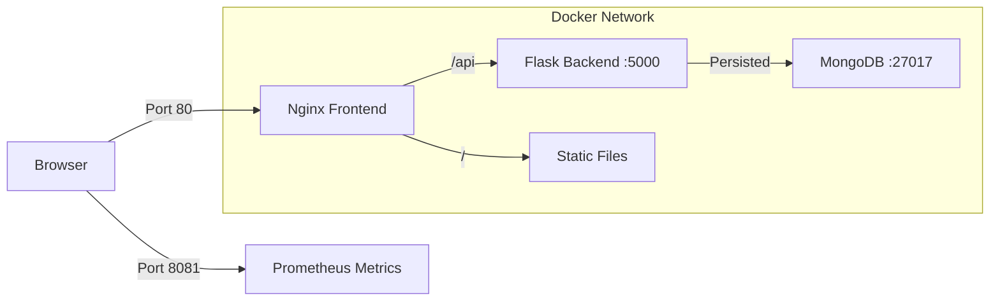

# SmartCart

<div align="center">


**A family grocery list management application with multi-tenancy support and AI-powered price estimation.**

[Quick Start](#quick-start) • [Architecture](#architecture) • [Features](#features) • [Development](#development)

</div>

## Overview

SmartCart is a collaborative web application designed to streamline grocery shopping for families and groups. It allows members to add items to a shared list, while managers maintain control through approval workflows. The system leverages AI to estimate prices automatically, helping users budget effectively.

## Features

-   **Multi-Tenancy**: Complete data isolation between groups using `family_id`.
-   **Role-Based Access**: Granular permissions for **Managers** (approve/reject/manage users) and **Members** (add items).
-   **AI Integration**: Automatic price estimation for added items using OpenAI.
-   **Real-Time Sync**: Polling mechanism ensures all users see the latest list state.
-   **Observability**: Integrated Prometheus metrics for monitoring application health and usage.

## Architecture

SmartCart employs a containerized microservices architecture orchestrated by Docker Compose.



### Services

| Service | Internal Port | Host Port | Description |
| :--- | :--- | :--- | :--- |
| **Frontend** | 80 | **80** | Nginx serving static assets and reverse proxying API requests. |
| **Backend** | 5000 | - | Flask REST API (accessible only via Nginx). |
| **Backend (Metrics)** | 8081 | **8081** | Dedicated Prometheus metrics endpoint. |
| **Database** | 27017 | - | MongoDB for data persistence. |

## Quick Start

### Prerequisites

-   [Docker](https://docs.docker.com/get-docker/) and [Docker Compose](https://docs.docker.com/compose/install/)
-   An OpenAI API Key (optional, for price estimation features)

### Installation & Running

1.  **Clone the Repository**
    ```bash
    git clone https://github.com/yourusername/SmartCart.git
    cd SmartCart
    ```

2.  **Configure Environment**
    Create a `.env` file from the example:
    ```bash
    cp .env.example .env
    # Edit .env and allow inserting your OPENAI_API_KEY if available
    ```

3.  **Launch Application**
    Build and start the services in detached mode:
    ```bash
    docker-compose up --build -d
    ```

4.  **Access the App**
    *   **Web Application**: [http://localhost](http://localhost)
    *   **Metrics**: [http://localhost:8081/metrics](http://localhost:8081/metrics)
    *   **Health Check**: [http://localhost/api/health](http://localhost/api/health)

### Stopping the App

To stop containers and preserve data:
```bash
docker-compose down
```

To stop containers and **destroy** data (reset):
```bash
docker-compose down -v
```

## Development

### Project Structure

```
SmartCart/
├── backend/                # Flask Application
│   ├── src/                # Source code
│   ├── tests/              # Pytest suites
│   └── Dockerfile          # Backend container definition
├── frontend/               # Static Web Assets
│   ├── nginx.conf          # Nginx configuration
│   └── Dockerfile          # Frontend container definition
├── docker-compose.yml      # Main orchestration file
└── docker-compose.test.yml # Test orchestration file
```

### Running Tests

We use a separate Docker Compose file for running integration tests to ensure isolation.

```bash
docker-compose -f docker-compose.test.yml up --build --abort-on-container-exit
```

### Local Development (Non-Docker)

If you prefer running the backend locally for debugging:

1.  **Install Dependencies**:
    ```bash
    cd backend
    python -m venv venv
    source venv/bin/activate
    pip install -r requirements.txt
    ```
2.  **Run MongoDB**: Use Docker to run just the DB.
    ```bash
    docker run -d -p 27017:27017 mongo:8.2
    ```
3.  **Run Flask**:
    ```bash
    export MONGO_URI="mongodb://localhost:27017/smartcart"
    python src/app.py
    ```
    *Note: The app will run on port 5000 by default.*

## Data Persistence

MongoDB data is persisted using a Docker named volume `mongodb_data`.
-   **Location**: Managed by Docker (usually `/var/lib/docker/volumes/...`).
-   **Persistence**: Data survives container restarts and valid `docker-compose down` commands.
-   **Backup**: You can use `docker run --rm -v smartcart_mongodb_data:/data -v $(pwd):/backup alpine tar czf /backup/db_backup.tar.gz /data` to create a backup.

## Troubleshooting

-   **Connection Refused**: Ensure containers are running with `docker ps`.
-   **Changes not reflected**: Run `docker-compose up --build -d` to rebuild images after code changes.
-   **Logs**: Check logs for specific services:
    ```bash
    docker-compose logs -f backend
    docker-compose logs -f frontend
    ```

## License

This project is licensed under the MIT License.
